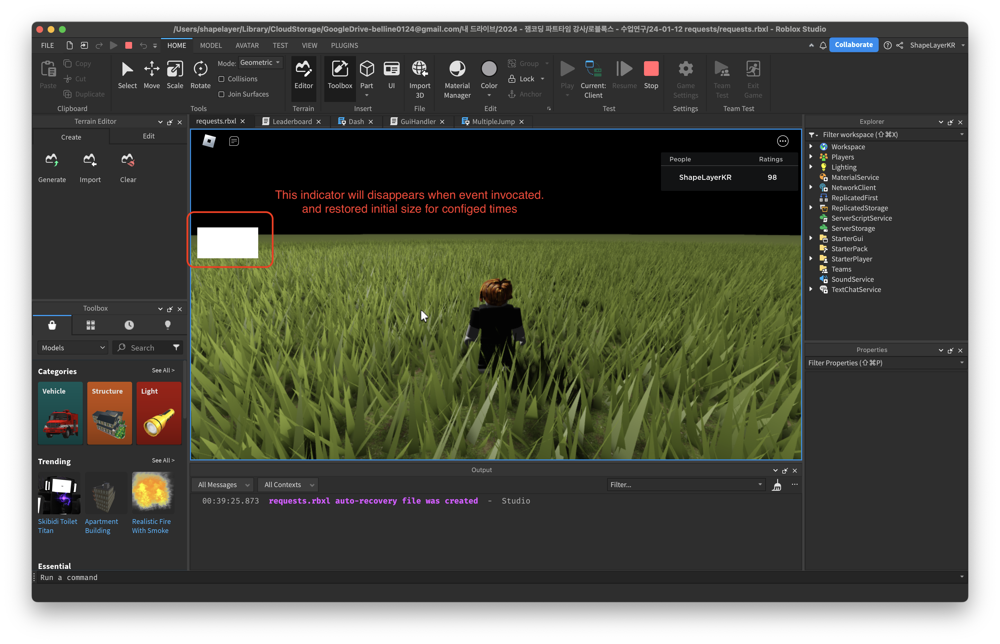
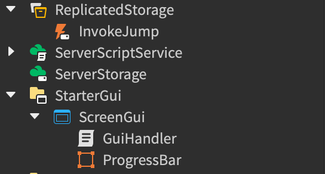

# Cooldown Indicator

  

## How to Setup

  

* Add any `ScreenGui` to `StarterGui`, and add `Frame` named `ProgressBar` under the added `ScreenGui`.  
* Add Script under the added `ScreenGui`.  
* Add `RemoteEvent` to `ReplicatedStorage` that invokes added Progressbar. This name must be equal with `config_eventName` parameter.
* Inject code to other code that fires event using [`Injection.lua`](./Injection.lua). For example, refer [`InjectionExample.lua`](./InjectionExample.lua)

## Parameters

* `config_coolDown`: `Number` Times that indicator until restored
* `config_eventName`: `String` Event name that will be invoked.
