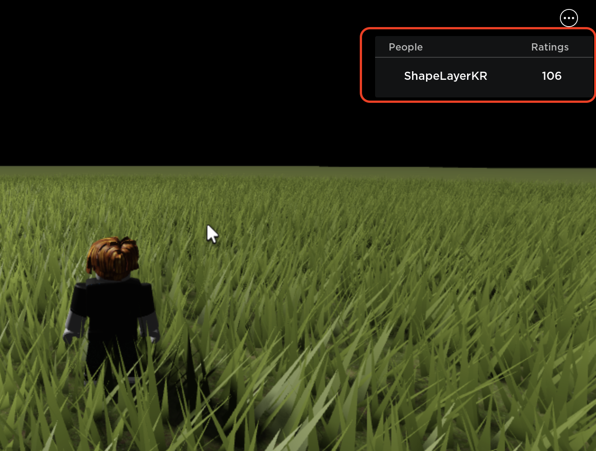

# Elapsed Time Leaderboard

## How to Setup

  

`ElapsedTimeLeaderboard.lua` script must be located in `/ServerScriptService`.  

## Parameters
* `config_time_waits`: `Number` Increases leaderboard after `config_time_waits` elapsed.
