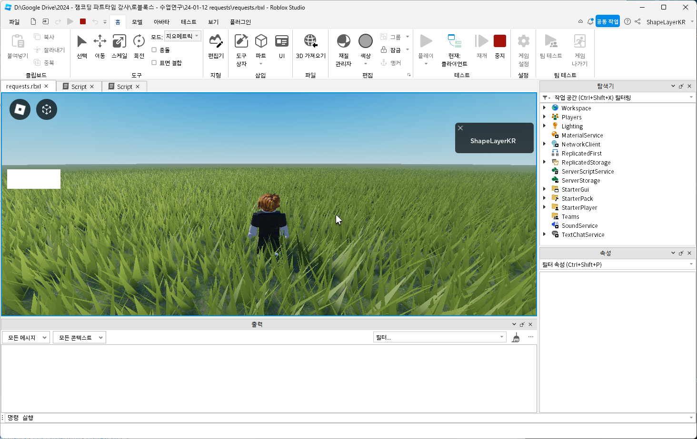
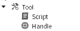

# Food

  
  

## How to Setup

  

* Add any `Tool` to `Workspace` or `StarterPack`.
* Add `MeshPart` under the added `Tool` and rename to `Handle`.
* Add [Script](./[Tool]/food.lua) under the added `Tool`.

## Parameters

* `config_healingOffset`: `Number` Amount of healing when use.
* `config_isDisposable`: `Boolean` Destroy when use if `true`
