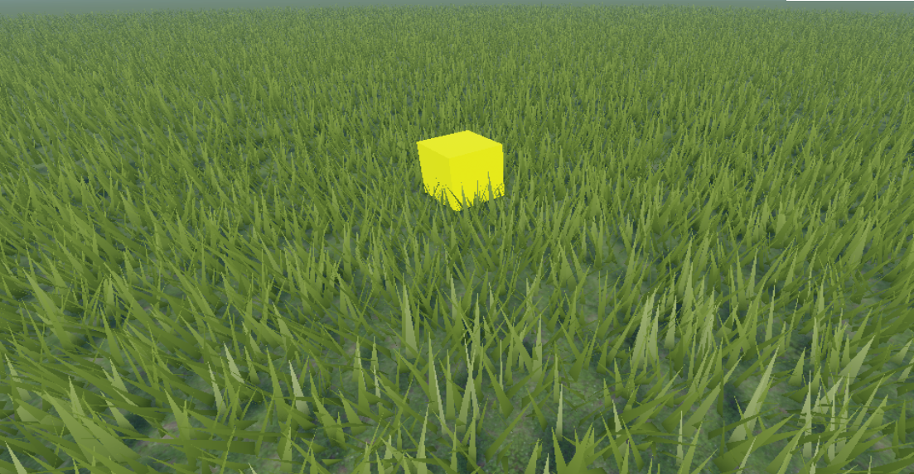
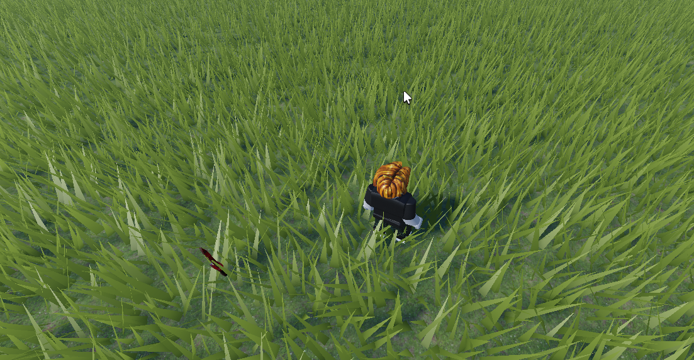
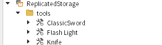

# Lucky Block

  
  

## How to use

Click block.

## Requirements

  

* Add any `Part` to `Workspace`.
* Add `ClickDetector` under the added `Part`.
* Add [Script](./[Part]/LuckyBlock.lua) under the added `Part`.

  
* Create folder named `tools`.
* Add any tools under the `tools` folder.

## Parameter

None. Chances of drops are all equal.  
