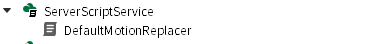

# Replace Default Animation

## Location
  

`DefaultMotionReplacer.lua` script must be located in `/ServerScriptService` as `Script`.

## Parameter
* `config_RunAnimID`: `String` The ID of animation asset.
* Other default animation can be changed. See code for details.

## Reference
* [Roblox, "Using Animations | Documentation".](https://create.roblox.com/docs/en-us/animation/using)
