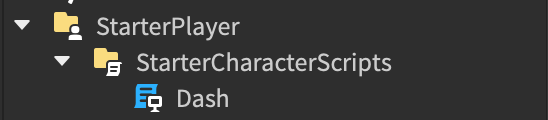

# Simple Dash

## Location

  

`Dash.lua` script must be located in `/StarterPlayer/StarterCharacterScripts` as `LocalScript`.  

## Parameters
* `config_invoke_key`: `Number` Key binding that invokes dash
* `config_dash_maxforce_limit`: `Number` Limit that dash's max force
* `config_dash_velocity_amplifier`: `Number` Amplifying offset that add speed when invoke dash
* `config_wait_loop_range`: `Number` Internal number of repetitions that processing dash
* `config_duration_each_one_loop_cycle`: `Number` Delays each repetitions
