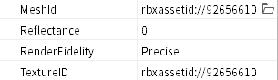

# Simple Tool / Water Grid Gun

  

## Location and Requirements

  

* Add any `Tool` to `Workspace`.
* Add `ClickDetector` under the `Tool` added.
* Add `EventHandler` under the `Tool` added.
* Add `MeshPart` under the `Tool` added and rename to `Handle`.
* Adjust `Handle`'s parameter.
  * `MeshId`: ID of mesh asset.
  * `TextureID`: ID of texture asset.
  * In demo, `MeshId` and `TextureID` configured to `rbxassetid://92656610`.
      

## Parameters

* `config_toolName`: `String` Name of tool
* `config_toolTip`: `String` Tooltip of tool
* `config_hotbarIconAssetID`: `String` AssetID for hotbar icon of tool
* `config_replaceTerrainRange`: `Number` Range of material gun generating
* `config_replaceTerrainYMin`: `Number` Min y Range of material gun generating
* `config_replaceTerrainYMax`: `Number` Max y Range of material gun generating
* `config_replaceTerrainResolution`: `Number` Resolution of grid used to generate material
* `config_replaceTerrainReplaceTo`: `Enum.Material` Material type that will be generated
