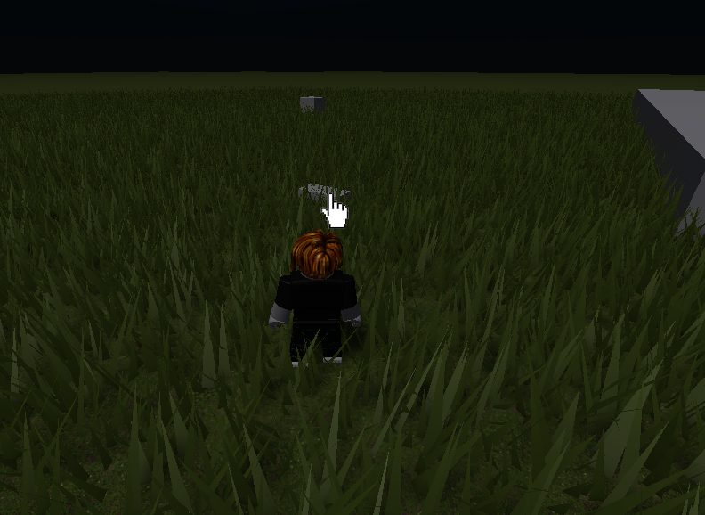

# Time of Day Changer

  
  

## How to Setup

  

* Add any `Part` to `Workspace`.
* Add `ClickDetector` under the added `Part`.
* Add [Script](./[Part]/TimeOfDayChanger.lua) under the added `Part`.
